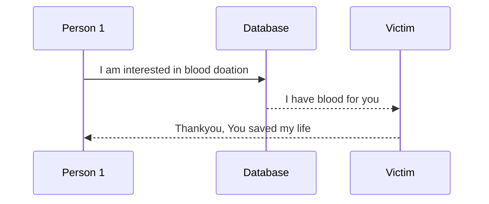

# Readme!


## About Blood Database
Hi! we are students from Pokhara University pursuing Bachelor in Computer Engineering. As the first project we have tried to build a **Blood Database**. It is a simple web application developed in Python where one interested person can register entering his Blood information and location. The provided information is intended  be helpful when another person who is in search of blood finds it.


# Installation

1. Install Python 
2. Setup  phpMyAdmin and create a database named  **blood_db**
3. Clone the repository on your machine.
4. Go to directory /Blood_DB and type following commands.
```bash
python get-pip.py #installs pip
pip install -r req.txt #install required models specified in req.txt
python #setup database
>>from app import db
>>db.create_all()
>>exit()
python app.py

```

## UML diagrams



